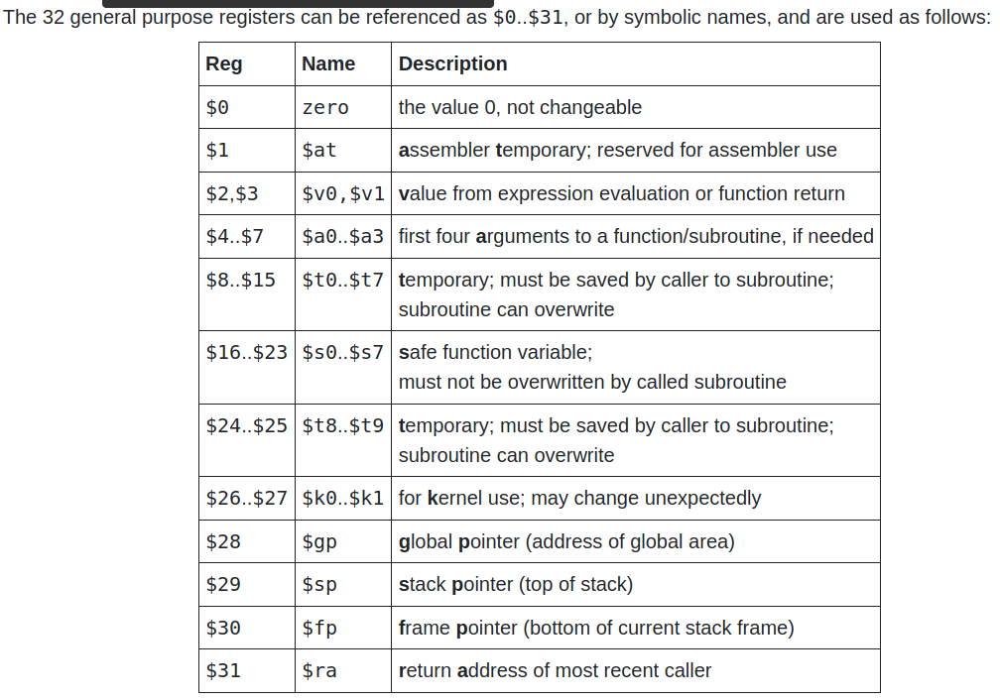
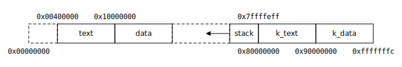
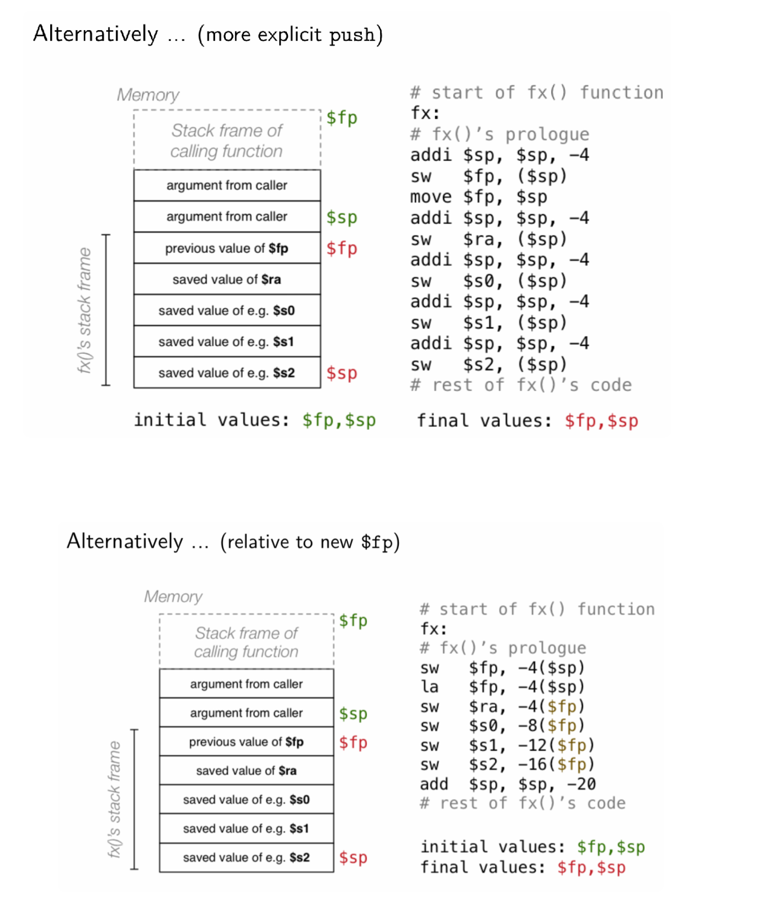

# Functions

## Registers

## Memory

## Functions

int main (void) {

    li $s0, 1
    li $t0, 1
    add(1, 2);
    $s0 == 1
    $t0 might not 1

}

int add(int a, int b) {
    # it save all the s registers
    sw $s0 address
    sw $s1 address+4

}