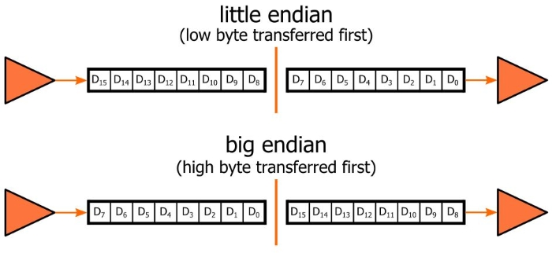

Consider the following memory state:

Address       Data Definition
0x10010000    aa:  .word 42
0x10010004    bb:  .word 666
0x10010008    cc:  .word 1
0x1001000C         .word 3
0x10010010         .word 5
0x10010014         .word 7

    .data
aa:
    .word 42
la $t0, aa   # loads the adddress 'something' into $t0
like a pointer

lw $t1, something

lw $t1, aa(0)       # loads the contents of 'something' into $t0
like deferencing a pointer

What address will be calculated, and what value will be loaded into register $t0, after each of the following statements (or pairs of statements)?

la == load address

lb == load byte
lh == load half word == load 2 bytes
lw == load word == load 4 bytes

sw == save word == save 4 bytes

# a.
la   $t0, aa

# b.
lw   $t0, bb

# c. Let's skip this..
lb   $t0, bb

# d.
lw   $t0, aa+4

# e.
la   $t1, cc
lw   $t0, ($t1)

# f.
la   $t1, cc
lw   $t0, 8($t1)

# g.
li   $t1, 8
lw   $t0, cc($t1)

# h.
la   $t1, cc
lw   $t0, 2($t1)

## Litte Endian vs Big Endian

666 == 0x029a == 0b 0000 0010 1001 1010

0000 0010 1001 1010 - big endian
|                 |
start            end

0b 0000 0010 1001 1010 - little endian
Most computers (including CSE computers) are actually little endian.

666 == 0x029a

00 00 02 9a

9a 02 00 00

9a

Since we are dealing with little-endian, 0x9a is loaded.

We aren't done yet! 0x9a == 0b1001 1010 - this is negative in two's complements

lb sign extends, so $t0 becomes 0xffffff9a.

# Let's go back to c

lb   $t0, bb
