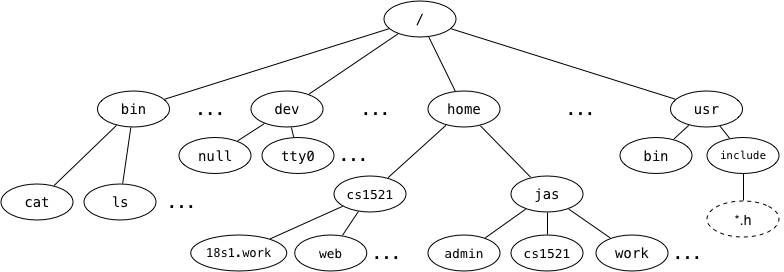

We say that the Unix filesystem is tree-structured, with the directory called / as the root of the tree, e.g.,

Answer the following based on the above diagram:

    a. What is the full pathname of COMP1521's web directory?
/home/cs1521/web

    b. Which directory is ~jas/../..?
"/" - root directory
"." - current directory
".." - parent directory
"~" - home directory

    c. Links to the children of a given directory are stored as entries in the directory structure. Where is the link to the parent directory stored?
Directory is a file.
    
    d. What kind of filesystem object is cat?
cat is a normal file.

    e. What kind of filesystem object is home?
home is a directory.

    f. What kind of filesystem object is tty0?
dev - devices
tty0 - character special file - actually a  device you can read/write to as if it were an actual file.
/dev/null - blackhole

    g. What kind of filesystem object is a symbolic link? What value does it contain?
PWD: jas; cd cs1521; actually changes to /home/cs1521
Pathname to another file.
"/home/cs1521"

    h. Symbolic links change the filesystem from a tree structure to a graph structure. How do they do this?
