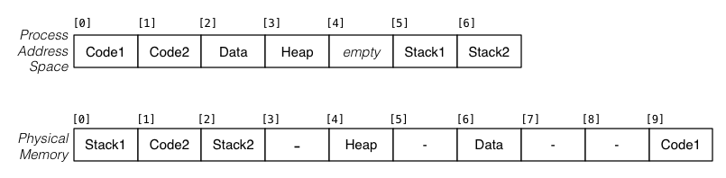

Consider a process whose address space is partitioned into 4KB pages and the pages are distributed across the memory as shown in the diagram below:

The low byte address in the process is 0 (in Code1) and the top byte address in the process is 28671 (max address in page containing Stack2).

For each of the following process addresses (in decimal notation), determine what physical address it maps to.

a. `jal func`, where the label `func` is at 5096

b. `lw $s0,($sp)`, where `$sp` contains 28668

c. `la $t0, msg`, where the label `msg` is at 10192
